semua hasilnya bisa dilihat di folder result

Hasil log optimize dan jmxnya bisa dilihat di folder result/optimize
hasil optimize
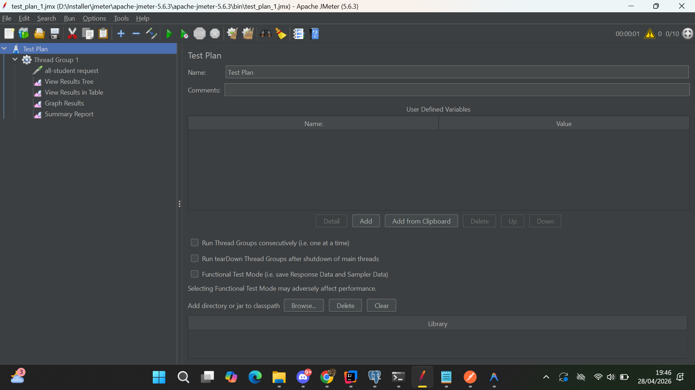

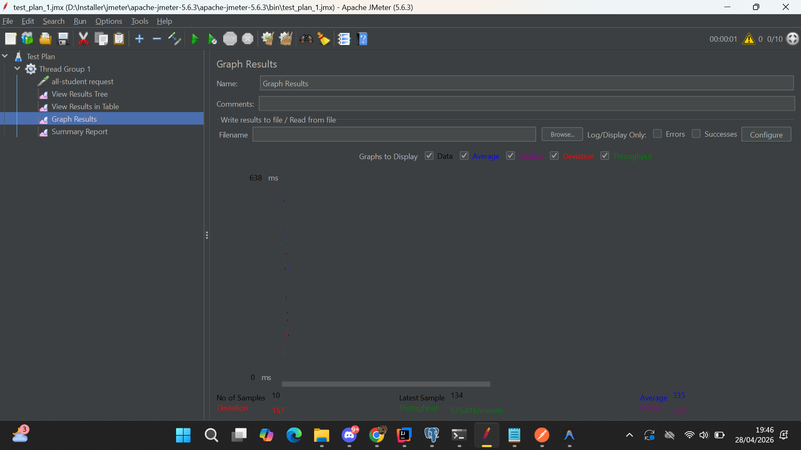
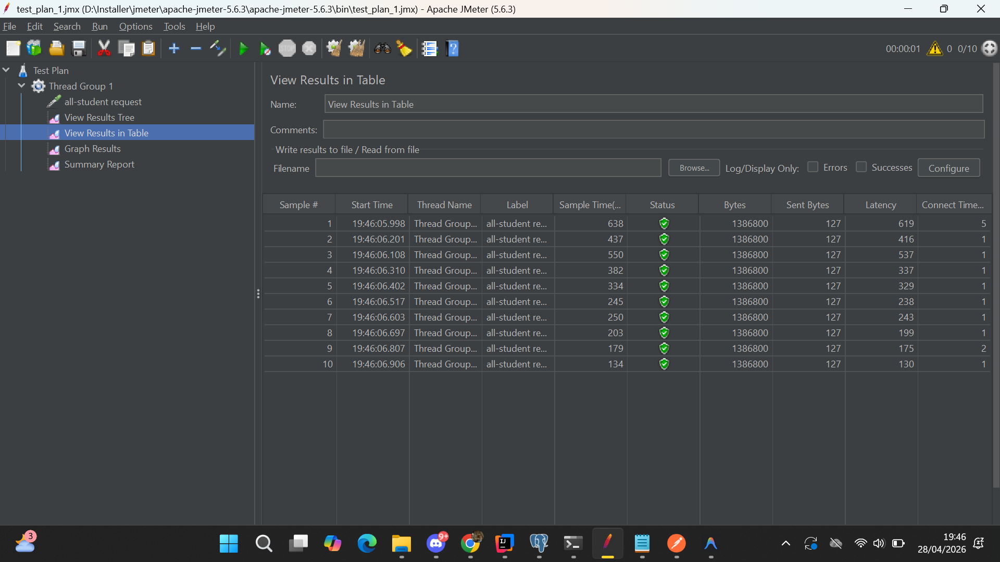
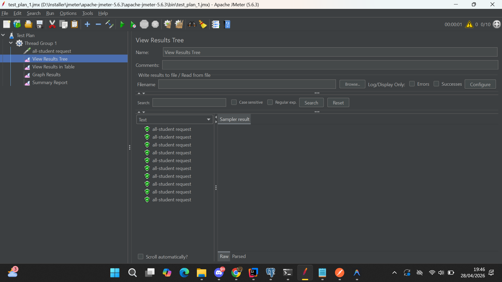

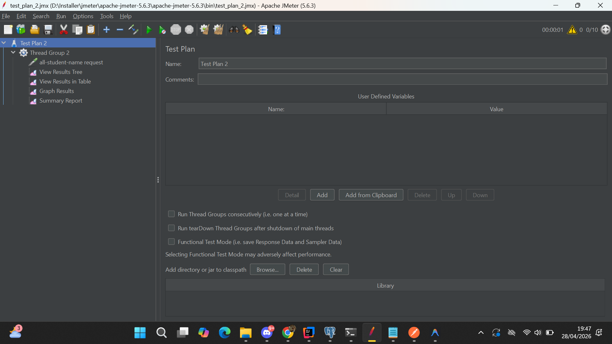
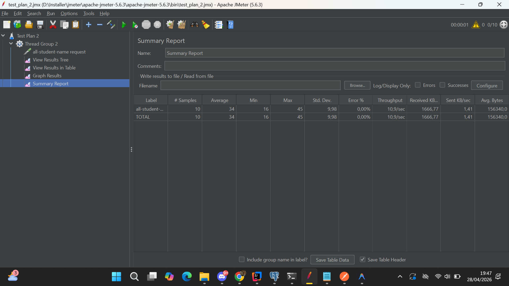
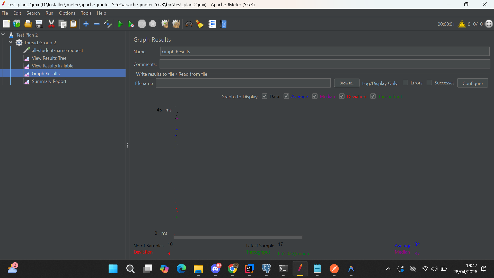
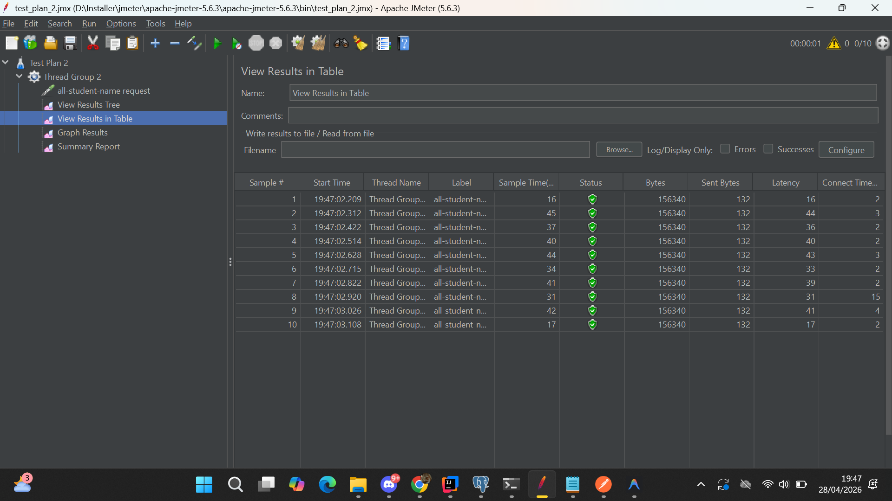
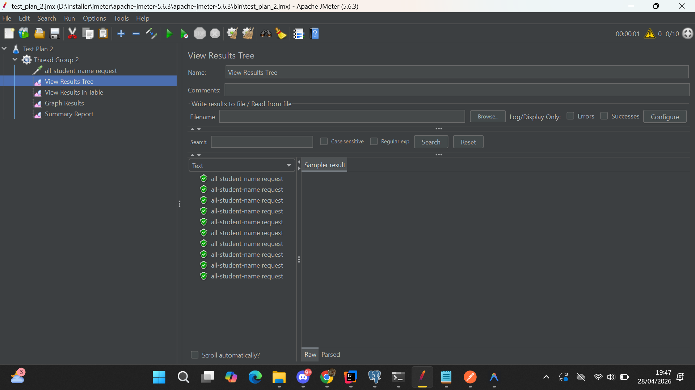
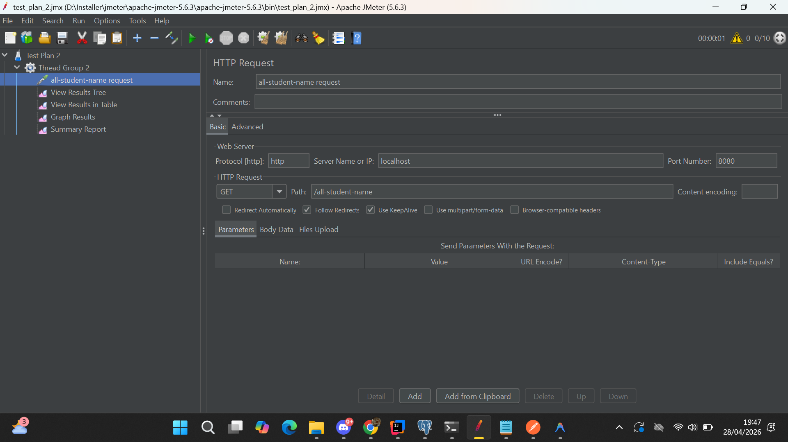
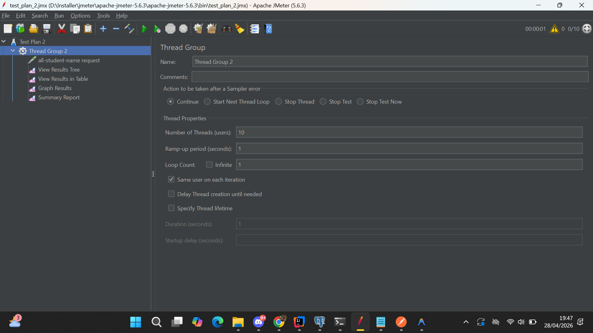

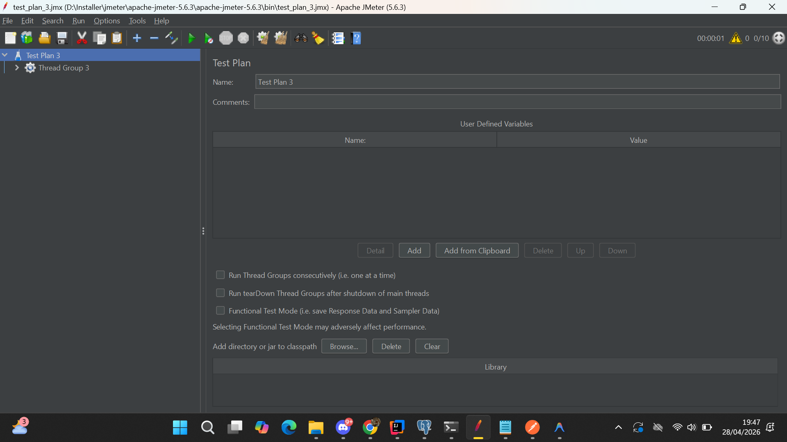

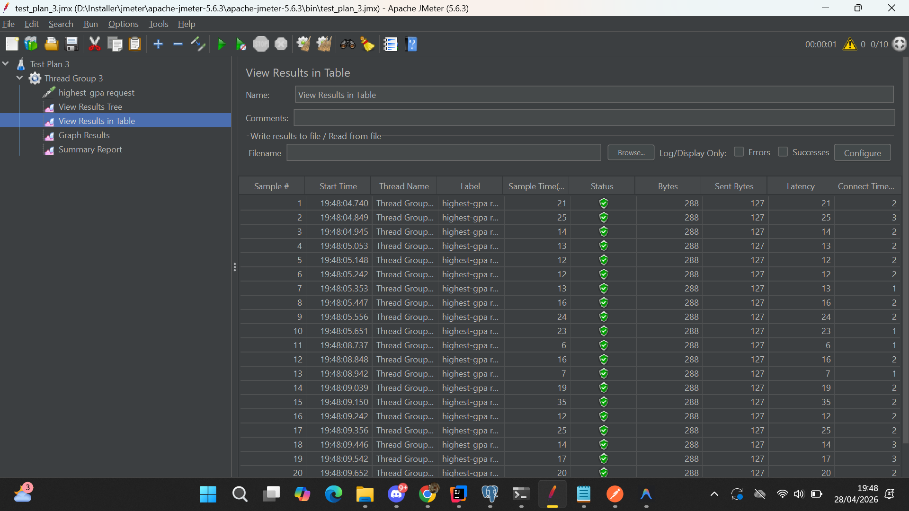
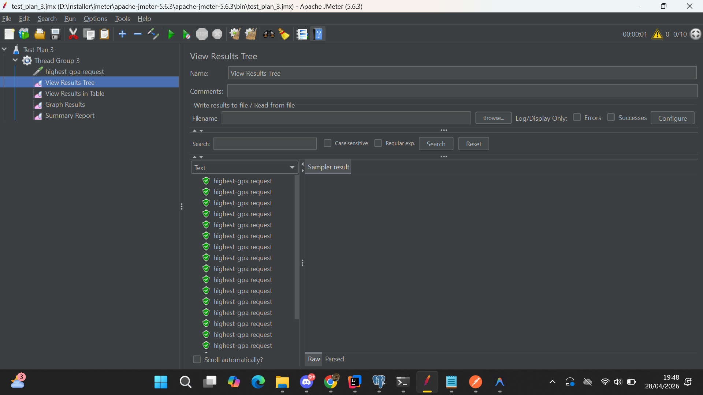

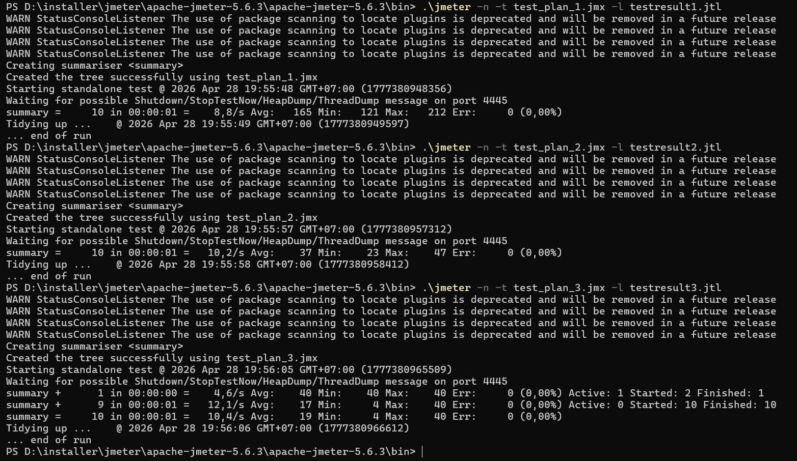
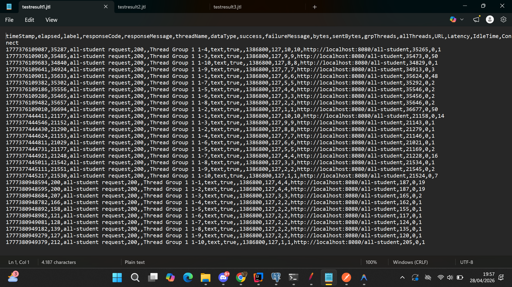
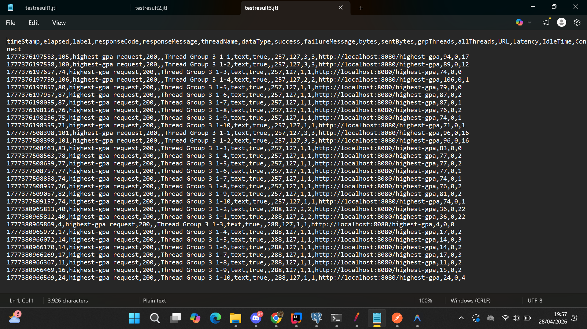
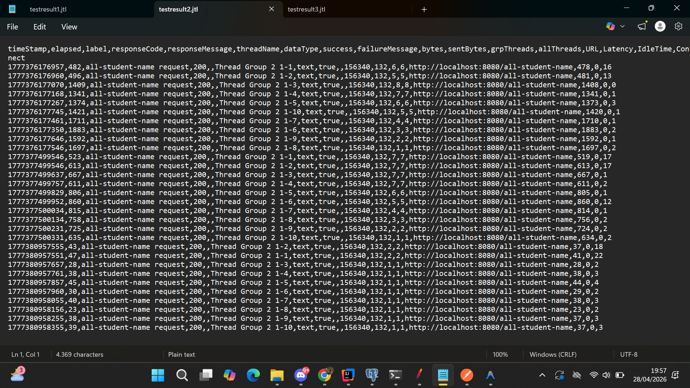

---

## Reflection

### 1. Perbedaan pendekatan performance testing dengan JMeter dan profiling dengan IntelliJ Profiler

JMeter dan IntelliJ Profiler memiliki pendekatan yang berbeda dalam mengoptimasi performa aplikasi. **JMeter** digunakan untuk **performance testing dari sisi eksternal** — yaitu mensimulasikan banyak user yang mengakses endpoint secara bersamaan, lalu mengukur metrik seperti response time, throughput, dan error rate. JMeter melihat aplikasi sebagai "black box" dan fokus pada bagaimana aplikasi merespons beban dari luar.

Sementara itu, **IntelliJ Profiler** bekerja dari **sisi internal** — yaitu menganalisis kode yang sedang berjalan untuk melihat method mana yang paling banyak mengonsumsi CPU time, alokasi memori, dan jumlah pemanggilan. Profiler memberikan pandangan "white box" sehingga kita bisa mengetahui *di mana tepatnya* bottleneck terjadi di dalam kode.

Singkatnya, JMeter menjawab *"seberapa lambat?"*, sedangkan IntelliJ Profiler menjawab *"mengapa lambat?"*.

### 2. Bagaimana proses profiling membantu mengidentifikasi dan memahami titik lemah aplikasi

Proses profiling sangat membantu karena memberikan visualisasi detail tentang eksekusi kode. Dengan flame graph dan call tree di IntelliJ Profiler, kita bisa melihat:
- **Method mana** yang paling banyak menghabiskan waktu eksekusi
- **Berapa kali** suatu method dipanggil (misalnya N+1 query problem terdeteksi karena query dipanggil ratusan kali)
- **Alokasi memori** yang berlebihan akibat pembuatan objek yang tidak perlu

Contohnya pada proyek ini, profiling menunjukkan bahwa method `getAllStudentsWithCourses` memanggil `findByStudentId` secara berulang untuk setiap student, yang menyebabkan N+1 query problem. Tanpa profiling, bottleneck ini sulit ditemukan hanya dengan melihat kode secara manual.

### 3. Apakah IntelliJ Profiler efektif dalam membantu menganalisis dan mengidentifikasi bottleneck

Ya, IntelliJ Profiler **sangat efektif** untuk menganalisis bottleneck. Kelebihannya antara lain:
- **Terintegrasi langsung** dengan IDE sehingga tidak perlu setup tool tambahan
- **Flame graph** yang intuitif untuk melihat distribusi waktu eksekusi
- **Bisa langsung navigate** ke source code dari hasil profiling
- Menampilkan **CPU time dan wall-clock time** sehingga bisa membedakan antara kode yang compute-intensive vs I/O-bound

Dengan profiler, kita bisa memvalidasi hipotesis tentang penyebab lambatnya aplikasi dengan data yang konkret, bukan sekadar tebakan.

### 4. Tantangan utama dalam melakukan performance testing dan profiling, serta cara mengatasinya

Beberapa tantangan utama yang dihadapi:
- **Overhead dari profiler**: Profiling menambahkan overhead pada aplikasi, sehingga angka absolut yang ditampilkan tidak merepresentasikan performa sebenarnya. Cara mengatasinya adalah dengan fokus pada **perbandingan relatif** antar method, bukan angka absolutnya.
- **Data yang terlalu banyak**: Profiler menghasilkan banyak data sehingga bisa overwhelming. Solusinya adalah memfilter dan fokus pada method yang berada di hot path.
- **Konsistensi environment testing**: Hasil JMeter bisa bervariasi tergantung kondisi mesin. Solusinya adalah menjalankan test berulang kali dan mengambil rata-ratanya, serta memastikan tidak ada proses berat lain yang berjalan bersamaan.
- **Menentukan baseline**: Sulit menentukan apakah performa sudah "cukup baik". Solusinya adalah menetapkan target yang jelas (misalnya improvement minimal 20%).

### 5. Manfaat utama dari penggunaan IntelliJ Profiler

Manfaat utama yang didapat:
- **Identifikasi cepat**: Bisa langsung menemukan method yang menjadi bottleneck tanpa perlu menebak-nebak
- **Data-driven optimization**: Keputusan optimasi didasarkan pada data metrik yang konkret, bukan intuisi
- **Efisiensi waktu**: Tidak perlu menambahkan logging manual di setiap method untuk mengukur waktu eksekusi
- **Deteksi N+1 query**: Dengan melihat jumlah pemanggilan method repository, bisa langsung terdeteksi jika ada query yang dipanggil berlebihan
- **Validasi hasil optimasi**: Bisa membandingkan hasil profiling sebelum dan sesudah optimasi untuk memastikan perbaikan benar-benar efektif

### 6. Menangani situasi ketika hasil profiling tidak sepenuhnya konsisten dengan hasil performance testing JMeter

Inkonsistensi antara hasil profiling dan JMeter bisa terjadi karena keduanya mengukur hal yang berbeda. Cara menanganinya:
- **Pahami konteksnya**: JMeter mengukur end-to-end response time (termasuk network, serialization, dll), sedangkan profiler fokus pada CPU/memory di level kode. Bottleneck bisa saja ada di luar kode aplikasi (misal database, network).
- **Ulangi pengujian**: Jalankan kedua test beberapa kali untuk memastikan hasilnya konsisten dan bukan anomali.
- **Cek faktor eksternal**: Pastikan kondisi environment (database connection pool, memory, CPU load) sama pada saat testing JMeter dan profiling.
- **Prioritaskan JMeter**: Karena JMeter lebih mendekati pengalaman real user, gunakan hasil JMeter sebagai acuan utama untuk mengukur dampak perubahan, dan gunakan profiling untuk menentukan *apa* yang perlu diubah.

### 7. Strategi optimasi kode aplikasi dan memastikan perubahan tidak mempengaruhi fungsionalitas

Strategi yang saya terapkan:
1. **Identifikasi bottleneck** dengan profiling terlebih dahulu, lalu prioritaskan optimasi pada bagian yang memberikan dampak terbesar.
2. **Optimasi di level query**: Seperti yang dilakukan pada proyek ini — mengganti N+1 queries dengan `JOIN FETCH`, menggunakan projection query (`SELECT s.name`) untuk hanya mengambil kolom yang dibutuhkan, dan mendelegasikan logika ke database (misalnya `findFirstByOrderByGpaDesc`).
3. **Perubahan minimal**: Tidak mengubah interface/kontrak method yang sudah ada, sehingga controller dan kode lain yang bergantung pada service tidak perlu diubah.
4. **Validasi fungsionalitas**: Memastikan output endpoint tetap sama sebelum dan sesudah optimasi dengan menjalankan performance test ulang menggunakan JMeter dan membandingkan hasilnya.
5. **Version control**: Menggunakan branch terpisah (`optimize`) agar perubahan bisa di-review dan di-rollback jika terjadi masalah.